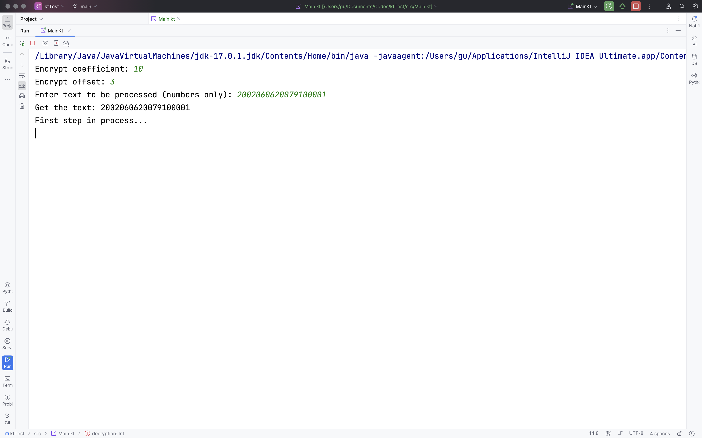
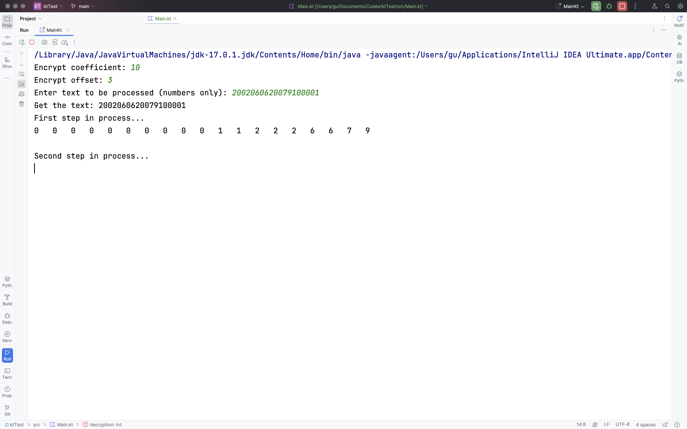
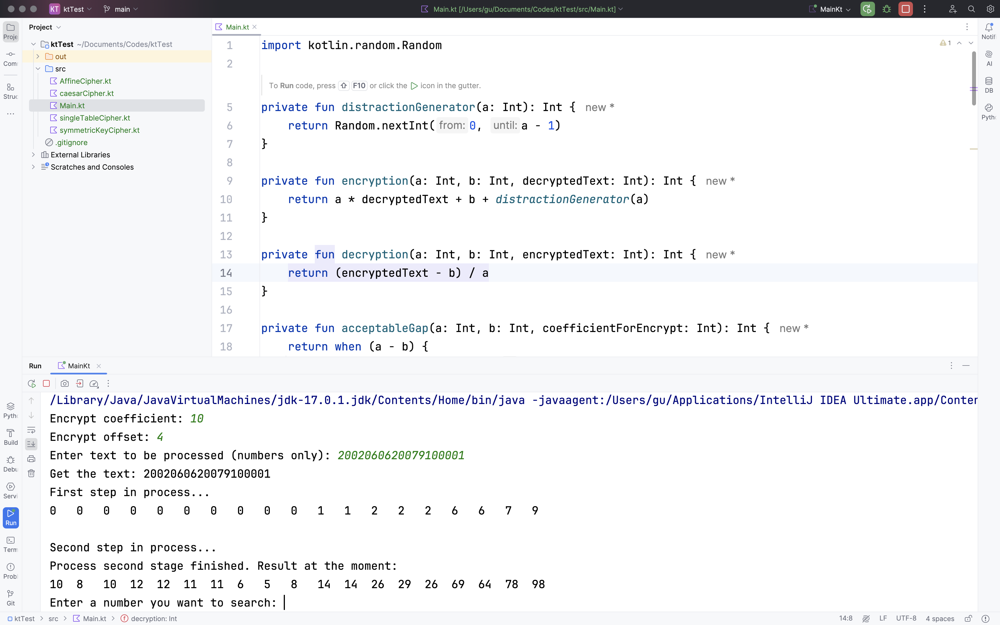
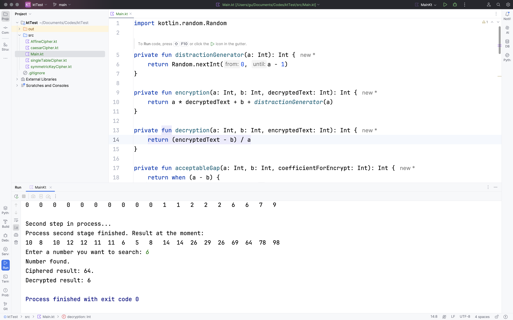
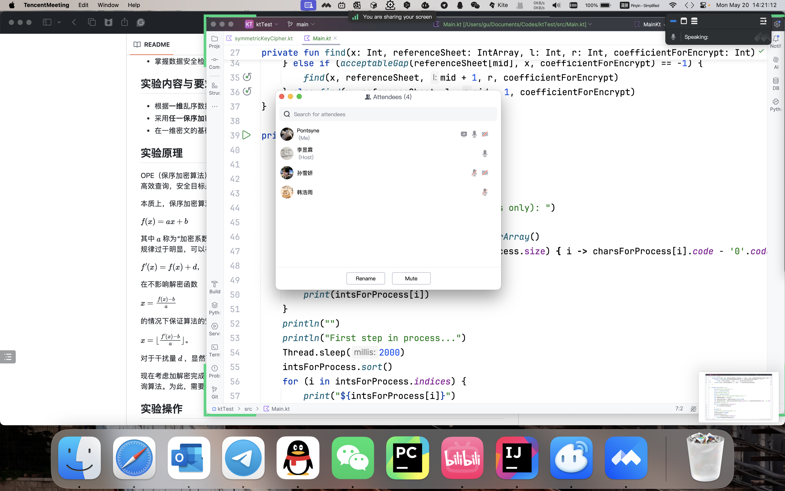

# 实验1 现代密码学基础技能
## 实验目的
- 掌握现代密码学基础技能。
## 实验内容与要求
- 任选DES/AES/SM4种的**一种**对称密码算法并实现；
- 针对多模式对称密码算法，仅需实现**一种**模式；
- 能够对字符串进行正确的加密和解密。
## 实验原理
**对称加密**指的是加解密使用同样密钥的加密方式。其中，DES加密算法于1977年由美国NSA根据IBM的专利技术Lucifer所制定；明文被分成64位的块，对每个块进行19次变换（替代和换位），其中16次变换由56位的秘钥的不同排列形式控制（IBM使用128位的秘钥），最后产生64位的密文块。后来基于DES设计出了改进算法三重DES（Triple-DES）。不过AES加密法已将DES替代，目前成为了对称加密算法中最为流行的之一。AES算法采用对称分组密码体制，密码的长度最少支持为128、192、256，分组长度128位，有很多轮重复和变换。

Javascript语言中拥有名为`CryptoJS`的库，可以支持包括AES和DES在内的大量对称加密算法。以`CryptoJS.AES`为例，对加密`CryptoJS.AES.encrypt`和解密`CryptoJS.AES.decrypt`有value（待加/解密字符串）、key（密钥）、iv（密钥偏移量）、mode（加密模式，默认为CBC，还可以是CFB、CTR、OFB、ECB）、pad（填充模式，默认为Pkcs7，还可以是AnsiX923、Iso10126、Iso97971、ZeroPadding、NoPadding）和encoding（编码格式，如Hex、Latin1、Utf8、Utf16、Base64）。其中，encoding可以将编码格式与WordArray对象互相转换。

`CryptoJS`库的其他属性在本次实验中并不关键，不再罗列。该库的其他介绍可参考[此链接](https://cryptojs.gitbook.io/docs)。
## 实验操作
由于本人自身的设备上没有javascript的加密库，因此本次实验的代码托管给了RunKit并在该平台上运行。在本次实验中，本人选择AES加密算法和CryptoJS默认的电子密码本模式（ECB）对字符串进行加密和解密；由于线上平台没有办法使用人机交互功能（例如引导使用者通过终端输入内容并根据该内容进行加/解密），在代码中插入了一段随机生成字符串的函数`generateRandomString`来保证此算法的普适性——这一函数可以根据给定数值随机生成长度等于该数值的字符串；本程式利用此函数可以确保密钥和待加密文本的随机性。

为方便起见，待加密文本`message`的长度设定为质数13，密钥`key`长度设定为质数5。显然，这两个长度互质。

为逐步观察，程式将输出随机生成的待加密文本内容加密前后的内容和密钥，并将在完成解密后显示解密后的文本。由于这些字符串的随机性，逐字符比较显然极为繁琐；为了方便起见，程式将在最后对加密前后的文本内容自动进行比较。当且仅当加密前后的文本内容一致时，结果将输出“Cipher success!”，即加解密流程完全成功；否则加密失败。

```javascript
var CryptoJS = require("crypto-js");

//The function is to be used to generate random strings as keys or text for encryption later on.
function generateRandomString(length) {
    const chars = 'abcdefghijklmnopqrstuvwxyzABCDEFGHIJKLMNOPQRSTUVWXYZ0123456789';
    let result = '';
    for (let i = 0; i < length; i++) {
        const randomIndex = Math.floor(Math.random() * chars.length);
        result += chars[randomIndex];
    }
    return result;
}

var message = generateRandomString(13);
var key = generateRandomString(5);

console.log("Text before encryption: " + message);
console.log("Key generated for encryption: " + key);

//ECB模式，启动

var cipherTextAES = CryptoJS.AES.encrypt(message, key,{
    mode: CryptoJS.mode.ECB,  
    padding: CryptoJS.pad.Pkcs7
}).toString();

console.log("Text after encryption: " + cipherTextAES);

var decryptedByteAES = CryptoJS.AES.decrypt(cipherTextAES, key, { 
    mode: CryptoJS.mode.ECB,  
    padding: CryptoJS.pad.Pkcs7
});
var decryptedTextAES = decryptedByteAES.toString(CryptoJS.enc.Utf8);

console.log("Text decryption finished. Before encoding: " + decryptedByteAES);

console.log("Encoded text: " + decryptedTextAES);

//decryptedTextAES=generateRandomString(13);

if (decryptedTextAES == message){
    console.log("Cipher success!");
}
else{
    console.log("Cipher failed. (FATAL: Text before & after the cipher is NOT the same)")
}
```

## 实验结果

运行程式，得到随机的结果之一如下图所示。可以看到，待加密信息为“qvu6pJwJj2Hz3”，密钥为“bWbfo”；加密之后得到密文“U2FsdGVkX18iAVSpSCUQrvmKmE8Wp5/Du3ziMedW6cg=”，解密后得到“71767536704a774a6a32487a33”；经过Utf8转码，得到解密后的文本“qvu6pJwJj2Hz3”，与加密前的明文一致。因此，最终输出为“Cipher success!”，即加解密正确。

</img>

## 验收
本次实验验收是在腾讯会议上完成的。

</img>

# 实验2 属性基加密综合实验

## 实验目的
- 掌握基本属性基加密的实现方式。
## 实验内容与要求
- 基于PBC算法库实现属性基加密；
- 能够完成明文的正确加密和密文的正确解密；
- 验证非法私钥不能解密得到原始明文。
## 实验原理
2022年，Doreen Riepel和Hoeteck Wee二人联合发布了一篇标题为《更快更安全的属性基加密（FABEO：Fast Attribute-based Encryption with Optimal Security）》的论文，并发布在CCS期刊上；其中提供了一种比之前常用的属性基加密更快的算法。这一算法使用了密文策略属性基加密（CP-ABE），并基于其既有算法进行了扩充。利用该论文中所给出的算法，可以更快速地进行本次实验。
## 实验操作
本次实验是在docker所提供的Linux（Ubuntu）虚拟操作环境中进行的。这是因为，本次属性基加密综合实验所需要的OpenSSL库系Ubuntu所自带。在下载并安装docker后，通过终端命令行输入
```
docker build -t fabeo .
```
，通过docker运用dockerfile构建了名为`fabeo`的实验容器。随后在该容器中输入
```
docker run -it fabeo
```
，开始进入Linux虚拟环境进行实验。随后只需要通过指令
```
cd FABEO && python samples/run_cp_schemes.py
```
即可在给定的属性基下进行加密。这里的`cp`还可以更换为`kp`或`dfa`，对应的算法也不尽相同。

和第一次实验一样，本次实验中的程式也是通过随机函数来生成待加密文本的。为可视化起见，明文在完成加密、解密两个操作后将自动与原本的明文相比较；当且仅当二者相同时，才能返回“Successful decryption for XX”。
## 实验结果
静待数秒，观察命令行返回的结果。可以看到，命令行在极短的间隔内一行一行地显示出了算法的解密结果如下图所示。显然，这一加解密操作是正确的。

</img>
## 验收
本次实验验收是在腾讯会议上完成的。
</img>
## 限制
由于docker内提供的Linux容器不具备`nano`、`vim`等编辑器，因此在建立容器后没有办法对源代码进行编辑。因此预期的进一步可视化操作（如将加密后的密文结果也显示出来）没有实现。
# 实验3 数据安全检索实验
## 实验目的
- 掌握数据安全检索的基本原理；
## 实验内容与要求
- 根据**一维**乱序数据能够自生成数据集；
- 采用**任一保序加密算法**进行加密；
- 在一维密文的基础上进行**范围查询**。
## 实验原理
OPE（保序加密算法）是一种密文保持明文顺序的特殊加密方案；其能在保护用户数据机密性的同时实现密文数据高效查询，安全目标是保证方案除明文顺序外而不泄露其他任何明文信息。

本质上，保序加密算法中的加密步骤依然是通过函数来实现的。为了实验简便，加密函数可以是函数

$f(x)=ax+b$

其中
$a$
称为“加密系数”，
$b$
称为“加密偏移量”。得到的
$f(x)$
值就可以作为明文数字
$x$
的处理结果；为了避免“密文”规律过于明显，可以在可控范围内加干扰量`d`，即

$f'(x)=f(x)+d$，

在不影响解密函数

$x=\frac{f(x)-b}{a}$

的情况下保证算法的安全性。换言之，解密函数可以修正为

$x=\lfloor{\frac{f'(x)-b}{a}}\rfloor$。

对于干扰量
$d$
，显然可以用数学方法证明当且仅当其在
$0$
至
$a-1$
之间时才可确保其对解密过程没有影响。

现在考虑加解密完成后的查询操作。结合人脑在进行查询某单位时的思路，不难采取二分法作为最有效、快捷的查询算法。为此，需要先对输入的数串进行排序，从而提高搜索时的效率。

## 实验操作
通过本机上的JetBrains IntelliJ IDEA Ultimate编写kotlin语言代码（文件后缀名为`.kt`）如下所示。随后编译并运行该脚本，观察实验结果。

为了方便观察，代码中在一些关键步骤中添加了短暂停滞（`Thread.sleep`）；按照预期，代码运行后将会在终端引导我们输入加密系数、偏移量和代加密数串，之后分步输出各步骤的处理结果。在输出排序后的原数串和加密数串时，代码会通过`print("\t")`将两个数串中彼此对应的每一项自动对齐，方便进行查看。

```kotlin
import kotlin.random.Random

//TIP To <b>Run</b> code, press <shortcut actionId="Run"/> or
// click the <icon src="AllIcons.Actions.Execute"/> icon in the gutter.
private fun distractionGenerator(a: Int): Int {
    return Random.nextInt(0, a - 1)
}

private fun encryption(a: Int, b: Int, decryptedText: Int): Int {
    return a * decryptedText + b + distractionGenerator(a)
}

private fun decryption(a: Int, b: Int, encryptedText: Int): Int {
    return (encryptedText - b) / a
}

private fun acceptableGap(a: Int, b: Int, coefficientForEncrypt: Int): Int {
    return when (a - b) {
        in 1 - coefficientForEncrypt..<coefficientForEncrypt -> 0
        else -> when (a - b < 0) {
            true -> -1
            else -> 1
        }
    }
}

private fun find(x: Int, referenceSheet: IntArray, l: Int, r: Int, coefficientForEncrypt: Int): Int {
    val mid = (l + r) / 2
    if (l > r) {
        return -1
    }
    return if (acceptableGap(referenceSheet[mid], x, coefficientForEncrypt) == 0) {
        mid
    } else if (acceptableGap(referenceSheet[mid], x, coefficientForEncrypt) == -1) {
        find(x, referenceSheet, mid + 1, r, coefficientForEncrypt)
    } else find(x, referenceSheet, l, mid - 1, coefficientForEncrypt)
}

private fun main() {
    print("Encrypt coefficient: ")
    val a = readln().toInt()
    print("Encrypt offset: ")
    val b = readln().toInt()
    print("Enter text to be processed (numbers only): ")
    val toBeProcessed = readln()
    val charsForProcess = toBeProcessed.toCharArray()
    val intsForProcess = IntArray(charsForProcess.size) { i -> charsForProcess[i].code - '0'.code }
    print("Get the text: ")
    for (i in intsForProcess.indices) {
        print(intsForProcess[i])
    }
    println("")
    println("First step in process...")
    Thread.sleep(2000)
    intsForProcess.sort()
    for (i in intsForProcess.indices) {
        print("${intsForProcess[i]}")
        if (i < intsForProcess.size - 1) {
            print("\t")
        } else println()
    }
    println()
    println("Second step in process...")
    Thread.sleep(2000)
    val intsAfterProcess = IntArray(intsForProcess.size) { i -> encryption(a, b, intsForProcess[i]) }
    println("Process second stage finished. Result at the moment: ")
    for (i in intsAfterProcess.indices) {
        print("${intsAfterProcess[i]}")
        if (i < intsForProcess.size - 1) {
            print("\t")
        } else println()
    }
    Thread.sleep(1000)
    print("Enter a number you want to search: ")
    val searchTarget = readln().toInt()
    val targetIndex = find(encryption(a, b, searchTarget), intsAfterProcess, 0, intsAfterProcess.size - 1, a)
    println(
        when (targetIndex != -1) {
            true -> "Number found.\nCiphered result: ${intsAfterProcess[targetIndex]}.\nDecrypted result: ${
                decryption(
                    a,
                    b,
                    intsAfterProcess[targetIndex]
                )
            }"

            else -> ("ERROR: Target not found in the result of the first stage.")
        }
    )
}
```
## 实验结果
为提高观感，这里以加密参数`10`、加密偏移量`4`为例对数串`2002060620079100001`进行加密并进行详细说明。

在输入这些参数后，程式先返回了输入的数串作为确认，随后告知第一步已经开始进行。
</img>

第一步的主要目的是对这些数据进行正向（由小到大）排序。这时程式返回阶段性结果如下，显然符合预期。随后，程式告知流程已进入第二步。
</img>

第二步的主要功能是对完成排序的这些数据进行“加密”处理。在完成第二步后，程式将返回完成处理的数串，此时进入第三步搜索阶段，程式引导用户输入需要检索的数字，随后开始查找。
</img>

输入数字`6`，可以看到程式立刻返回搜索完成的结果。可以看到，搜索到的数字`6`在处理后的数串中对应的一个值是`64`；对`64`进行解密，得到的结果仍然是`6`。换言之，查询和加解密过程均正确。
</img>

## 实验验收
本次实验是通过腾讯会议验收的。
</img>
